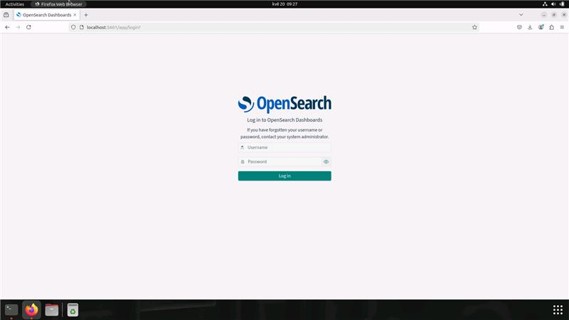
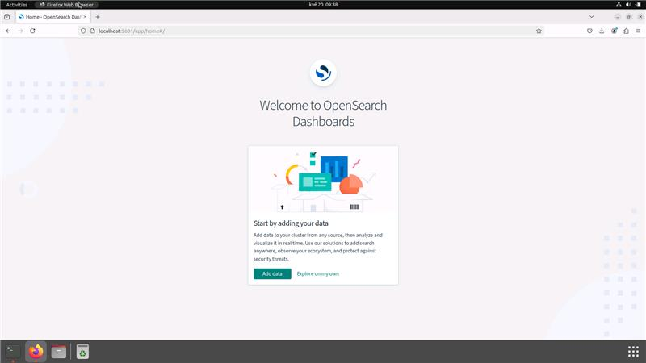
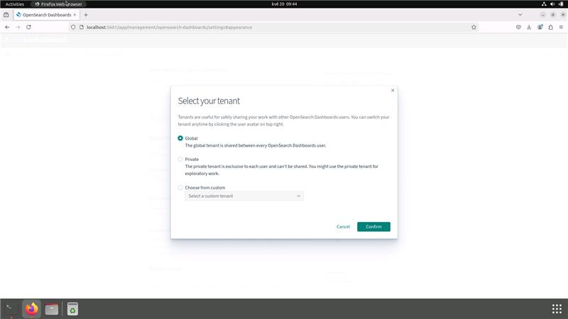
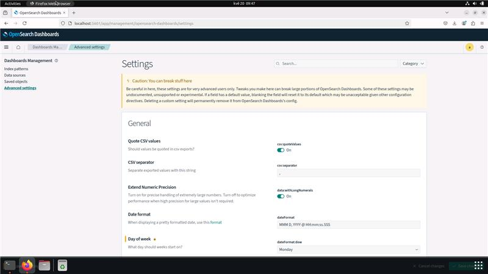
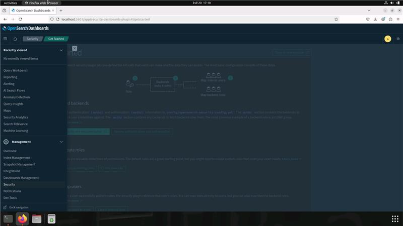
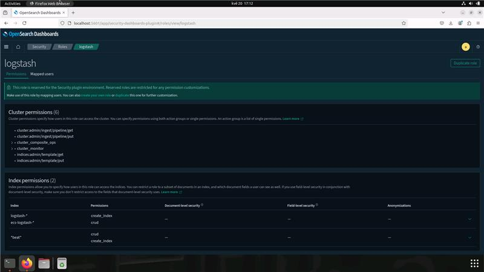
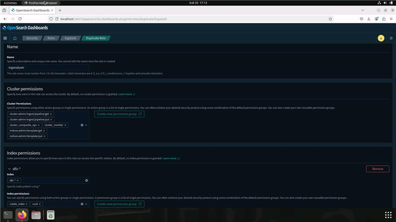
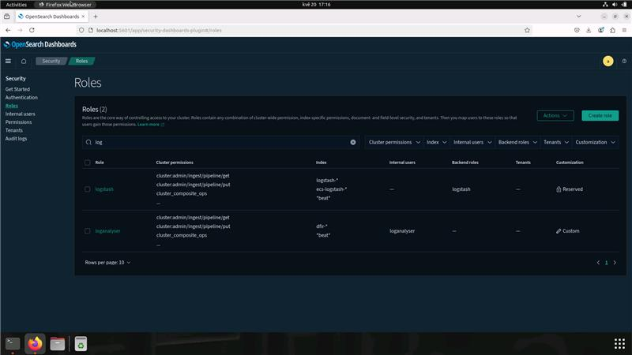

# Digital Forensic - Preparation of OpenSearch

During forensic analysis, it is often necessary to prepare a system for
analysis. This can include setting up a database, configuring the environment,
and ensuring that all necessary tools are installed. In this guide, we will
focus on preparing an OpenSearch instance for forensic analysis.

*Note: I was using
[Timeline Explorer](https://aboutdfir.com/toolsandartifacts/windows/timeline-explorer/)
for many years. It's nothing wrong with this amazing tool. I just found out
that it's possible to use OpenSearch during one case. And from that moment
I just keep using OpenSearch instead of Time Explorer.*

## Disclaimer

This guide is reflecting my personal experiences, preferences and is not
a definitive guide. As I already mentioned, I was using Timeline Explorer
for many years. I just tried to use OpenSearch and I found it very useful
due to support of queries and other features.

## Prerequisites

Installed and running:
- [Docker Engine](https://docs.docker.com/engine/install/)
- [Docker Compose](https://docs.docker.com/compose/install/)

## Guide

### 1. Create a directory for OpenSearch

First at all, we need to create structure of directories.

Create a directory for compose file.

```bash
sudo mkdir -p /opt/dfir/dfirtimeline
```

*Note: I am using here `/opt/dfir` as a main directory for all my DFIR tools.
Don't forget to change owner of directories that docker could work
with them properly.*

### 2. Create a Docker compose file

*Note: I am not going to create here guide/tutorial about Docker compose,
just quick overview about my usual settings which works for me really well.*

```bash
sudo nano /opt/dfir/dfirtimeline/compose.yaml
```

#### Name of application

```yaml
name: dfirtimeline
```

#### Basic definition of services

As first step, we need to define services which we are
going to use. There is used official images from OpenSearch project.
You can find them on [Docker Hub](https://hub.docker.com/r/opensearchproject).

*Note: I am using here version 3.0.0 of OpenSearch and OpenSearch Dashboards.*

```yaml
services:
  dfir-opensearch:
    image: opensearchproject/opensearch:3.0.0
    container_name: dfir-opensearch
    restart: always
  dfir-dashboards:
    image: opensearchproject/opensearch-dashboards:3.0.0
    container_name: dfir-dashboards
```

#### Volumes for services

Second step is to define volumes for services.

```yaml
volumes:
  opensearch-config:
  opensearch-data:
  opensearch-plugins:
  dashboard-config:
  dashboard-data:
```

#### OpenSearch - Environment

Adjust the environment variables according to your needs.
My settings are:
- Single node
- Memory lock
- Adjusting memory for Java
- Initial admin password (stored at `.env` file)

```yaml
    environment:
      - discovery.type=single-node
      - bootstrap.memory_lock=true
      - "OPENSEARCH_JAVA_OPTS=-Xms2g -Xmx2g"
      - OPENSEARCH_INITIAL_ADMIN_PASSWORD=${INIT_ADMIN_PASSWORD}
```

#### OpenSearch - Limits

Overrides the default *ulimits* for a container.

```yaml
    ulimits:
      memlock:
        soft: -1
        hard: -1
      nofile:
        soft: 65536
        hard: 65536
```

#### OpenSearch - Volumes

Mounting volumes for OpenSearch.

```yaml
    volumes:
      - opensearch-data:/usr/share/opensearch/data
      - opensearch-plugins:/usr/share/opensearch/plugins
      - opensearch-config:/usr/share/opensearch/config
```

#### OpenSearch - Ports

Adjust port mapping.

```yaml
    ports:
      - 9200:9200 # REST API
      - 9600:9600 # Performance Analyzer
```

#### Dashboards - Environment

```yaml
    environment:
      - 'OPENSEARCH_HOSTS=["https://dfir-opensearch:9200"]'
```

#### Dashboards - Volumes

Mounting volumes for OpenSearch Dashboards.

```yaml
    volumes:
      - dashboard-config:/usr/share/opensearch-dashboards/config
      - dashboard-data:/usr/share/opensearch-dashboards/data
```

#### Dashboards - Ports

Adjust port mapping.

```yaml
    ports:
      - 5601:5601 # Dashboards
```

Here is a sample [compose](files/scripts/compose.yaml) file for
OpenSearch and OpenSearch Dashboards.

### 3. Start-up OpenSearch

Everything should be ready to start OpenSearch.

```bash
cd /opt/dfir/dfirtimeline
sudo docker compose up -d
```

### 4. Login to OpenSearch Dashboards

Open your browser and go to `http://localhost:5601`. Try to log in with
the initial admin password. You can find it in the `.env` file.



You should see the OpenSearch Dashboards welcome screen after successful login.



Then select your tenant. It's fine just use global tenant.



### 5. Advanced settings

After successful login, you can adjust some advanced settings in OpenSearch
Dashboards. Go to `Management` -> `Dashboards Management` -> `Advanced settings`.



*Note: I am 'dark mode' person. So, next screenshots will be in dark mode.*

### 6. Create separate account for log analyzer

You can create a separate account for log analyzer.
Go to `Management` -> `Security` -> `Roles`.



Click on roles `logstash`. You can see the list of permissions
for this role. Click on `Duplicate role` button on top right corner.



Change the name of the role and adjust index permissions.

In my case, I am using *loganalyser* as name of the role and
`dfir-*` as index pattern.



After role is created, you can create a new user and map this user to the role.



### 7. Get Root CA certificate from OpenSearch

...

### 8. Done!

You can use OpenSearch for your forensic analysis.
